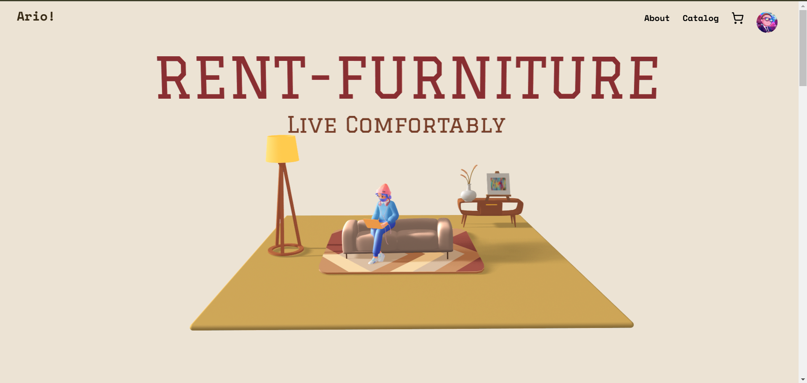
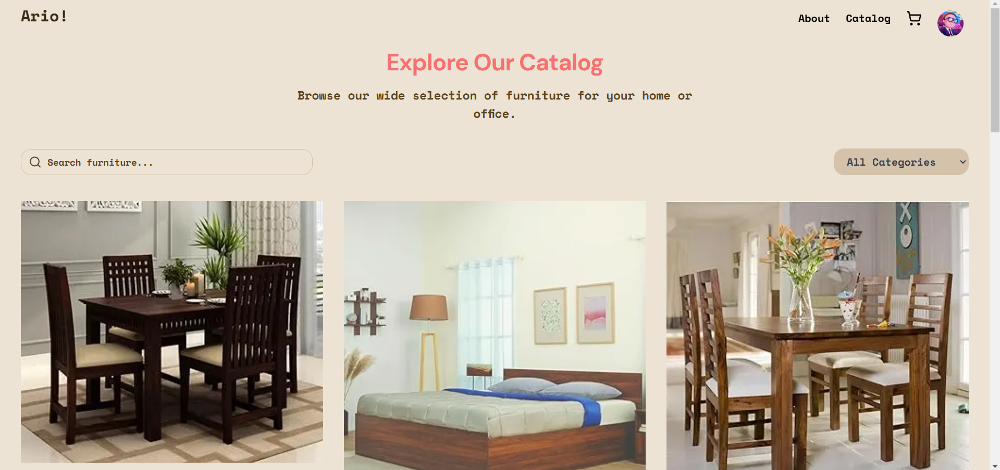
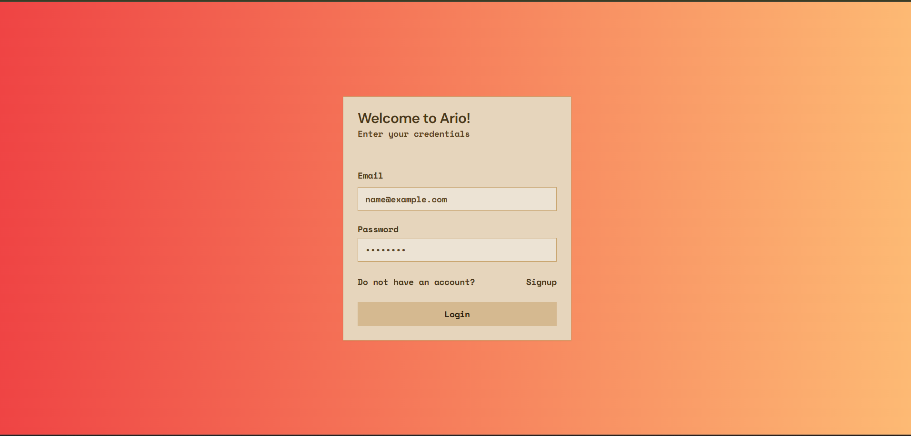
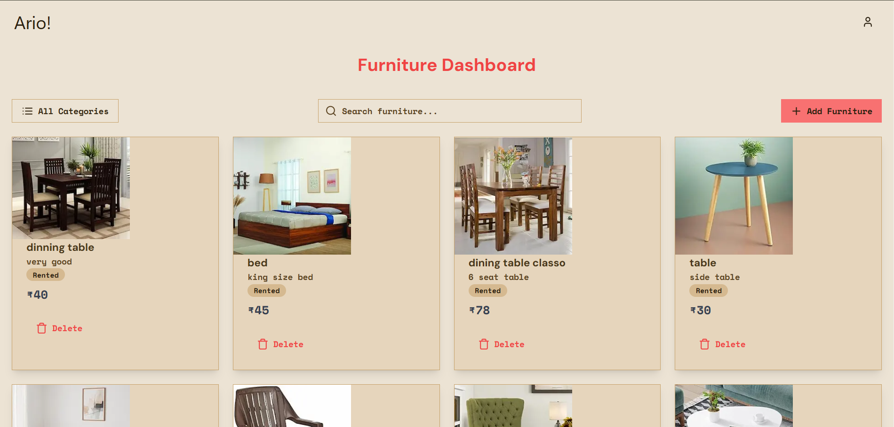

# Furniture Rental Website

Hosted at: [ario-two.vercel.app](https://ario-two.vercel.app/)

<p align="center">       </p>

This furniture rental platform enables users to explore, select, and rent a variety of furniture items while managing inventory through an admin dashboard. Built with Next.js and TypeScript, the website offers efficient and seamless user experience.



## Table of Contents
- [Features](#features)
- [Technologies Used](#technologies-used)
- [Getting Started](#getting-started)
- [Screenshots](#screenshots)
- [Dashboard](#dashboard)
- [Future Enhancements](#future-enhancements)

---

## Features

1. **User-Friendly Catalog**:
   - Paginated product listing.
   - Search and category filtering options.
   - Add-to-cart functionality.

2. **User Authentication**:
   - Login and registration using JWT for secure sessions.
   - Axios requests for seamless API interactions.

3. **Payment Integration**:
   - Smooth checkout with integrated payment functionality.

4. **Admin Dashboard**:
   - Allows admins to monitor inventory, add new items, and update existing items.
   - Real-time tracking of available furniture items and rental status.

5. **Furniture Details Pop-up**:
   - Detailed view with name, price, category, and description.
   - Easy-to-read, responsive design.

## Technologies Used
- **Frontend**: Next.js, TypeScript, Tailwind CSS
- **Backend**: Next.js API with TypeScript
- **Database**: MongoDB
- **Authentication**: JWT
- **Animations**: Framer Motion
- **File Upload**: FormData for image upload and handling

## Getting Started

1. **Clone the repository**:
   ```bash
   git clone https://github.com/kumawatvaibhav/Furniture-Rent.git
   cd Furniture-Rent
   ```

2. **Install dependencies**:
   ```bash
   npm install
   ```

3. **Setup environment variables**:
   Create a `.env` file at the root of the project with the following:

   ```env
   NEXT_PUBLIC_API_URL=<API_URL>
   MONGODB_URI=<MongoDB_Connection_URI>
   JWT_SECRET=<your_jwt_secret>
   ```

4. **Run the development server**:
   ```bash
   npm run dev
   ```

5. **Access the website**:
   Visit [http://localhost:3000](http://localhost:3000) in your browser.

## Screenshots

### Homepage


### Catalog Page


### Login Page


### Product Details Pop-up


### Checkout Page


---

## Dashboard

The **Admin Dashboard** is designed for effective inventory and order management:

- **Add New Furniture**: Upload images, enter details, and categorize products.
- **Inventory Management**: Track items, view stock availability, and monitor rentals.
- **User Orders**: View current rentals and order history.

### Dashboard Screenshot


---

## Future Enhancements
- **Enhanced Filtering**: Expand filtering by price range, rating, and material.
- **Analytics**: Provide sales and inventory insights for better management.
- **Wishlist Functionality**: Allow users to save favorite items for future rental.

## Contributing
Contributions are welcome! Please fork the repository and submit a pull request.

---
